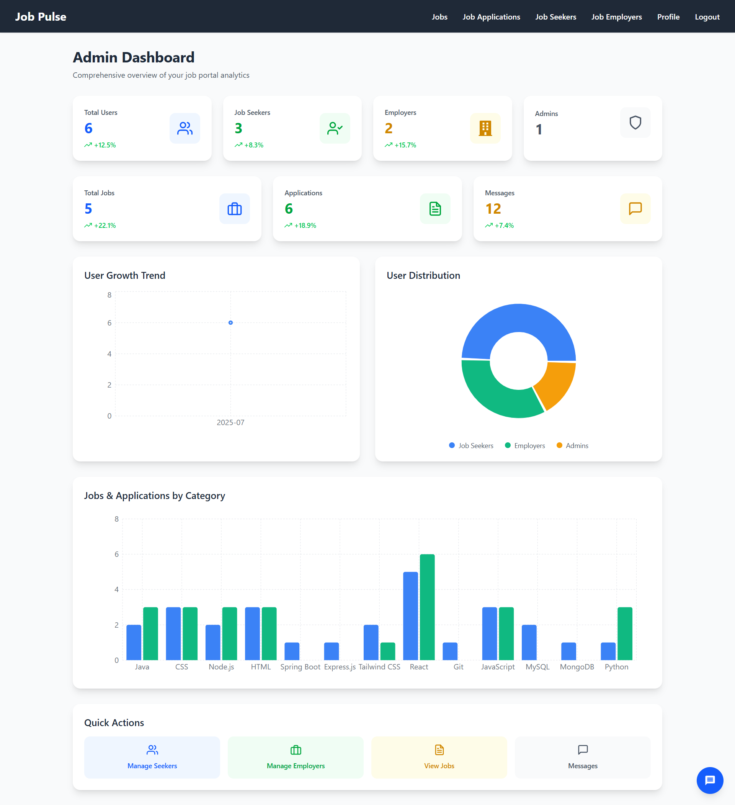
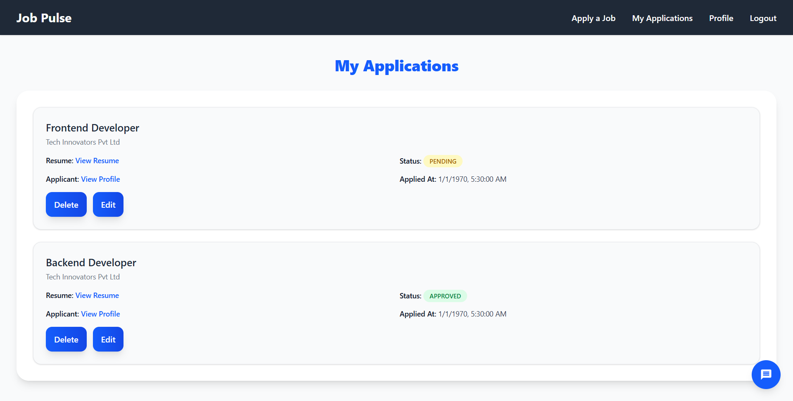
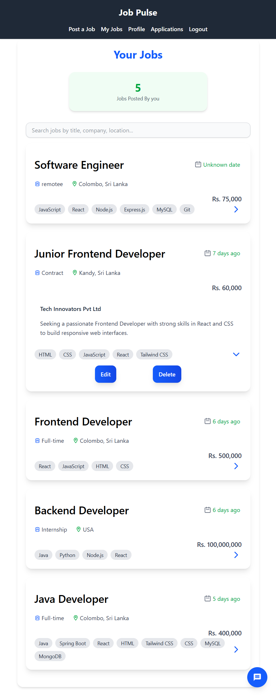
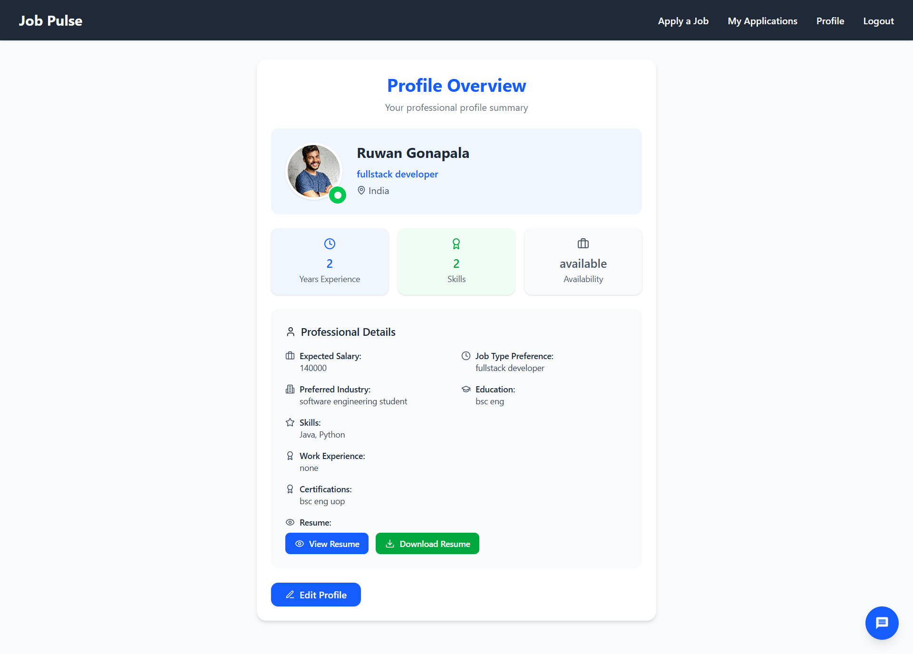

# 💼 Fullstack Job Portal | Java Spring Boot + React (Vite) + MySQL

This is a personal Fullstack Job Portal project built individually using Spring Boot (Java 21), React (Vite), and MySQL. It includes secure authentication with JWT, role-based access control, job posting & applications, resume uploads, real-time messaging, and an Admin Dashboard. Designed and developed from scratch to demonstrate fullstack engineering skills with Spring Boot & React.
---

## 📑 Table of Contents
- [Project Overview](#-project-overview)
- [Why This Project?](#-why-this-project)
- [My Role as Developer](#-my-role-as-developer)
- [Architecture](#-architecture)
- [Screenshots](#-screenshots)
- [Key Features](#-key-features)
  - [Authentication & Authorization](#-authentication--authorization)
  - [Messaging System](#-messaging-system)
  - [Role Capabilities](#-role-capabilities)
    - [Job Seekers](#-job-seekers)
    - [Employers](#-employers)
    - [Admins](#-admins)
  - [File Uploads](#-file-uploads)
- [Challenges Solved](#-challenges-solved)
- [What I Learned](#-what-i-learned)
- [Tech Stack](#-tech-stack)
- [Setup Instructions](#-setup-instructions)
  - [Prerequisites](#-prerequisites)
  - [Backend Setup](#-backend-setup)
  - [Frontend Setup](#-frontend-setup)
- [Continuous Integration & Code Quality](#-continuous-integration--code-quality)
- [Roadmap](#-roadmap)
- [Author](#-author)
- [License](#-license)


## 🚀 Project Overview

This fullstack Job Portal allows seamless interaction between Employers and Job Seekers. Key features include:

🧑‍💼 Employers can post, update, and delete job listings, and manage applications.

👨‍🎓 Job Seekers can browse, search, filter, and apply to jobs with uploaded resumes.

🔐 Secure login, registration, and password management using Spring Security

      Passwords are hashed with BCryptPasswordEncoder
      
      JWT-based authentication for stateless sessions
      
      Role-based access control enforced via @PreAuthorize annotations

💬 Messaging system enabling Employers and Job Seekers to communicate securely based on application status.

📂 Upload and view resumes, profile pictures, and company logos securely.

The project is fully developed individually, with a MySQL database backend, Spring Boot APIs, and a React + Vite frontend, demonstrating end-to-end fullstack development, database design, and security best practices.
---

## ❓ Why This Project?
- This project is ideal for developers who want to learn how to build a **fullstack job portal application** using **Spring  Boot, React, and MySQL**.  
- It covers authentication with JWT, secure file uploads, real-time messaging, and role-based access, making it a great reference for **portfolio projects** and **enterprise-style applications**.


## 🧑‍💻 My Role as Developer

- Designed and implemented RESTful APIs using Spring Boot
- Built a responsive frontend UI using React + Vite + Tailwind CSS
- Configured **JWT-based authentication and role-based access** using Spring Security
- Designed database schema and relationships in MySQL
- Integrated secure resume and profile image upload features
- Managed CORS, error handling, and environment configurations

---

## 🏗️ Architecture

| Layer    | Stack                                                                            |
| -------- | -------------------------------------------------------------------------------- |
| Frontend | React, Vite, Tailwind CSS, React Icons, React Router, React Toastify, ESLint     |
| Backend  | Java 21, Spring Boot, Spring Data JPA, Spring Security, PMD                      |
| Database | MySQL (local development), MariaDB via SkySQL (CI)                               |
| Tools    | Git, GitHub,Maven, Postman, JUnit                                                |

---

## 📸 Screenshots

### 🛠️ Admin Dashboard



### 📄 View Job Applications



### 📝 Job Details Page



### 👤 Profile View



## 🔗 Live Demo / Video

---

## 🧪 Key Features

### 🔐 Authentication & Authorization

- Login / Register / Forgot Password via email service
- **JWT Token** based secure authentication
- Role-based access control for Employers, Job Seekers, and Admins
- Logout functionality for all roles

### 💬 Messaging System

- Employers can message job seekers only **after a job application** exists
- Admins can message anyone
- Self-messaging and same-role messaging is **prohibited**
- **Read receipts** are enabled (users can see if their message was viewed)
- **Messages cannot be deleted** to ensure platform integrity

### 🧭 Role Capabilities

#### 👨‍🎓 Job Seekers

- Browse and search all job posts
- Apply to jobs with attached resume
- View and update profile
- Upload resume to profile and during job applications
- View submitted applications

#### 🧑‍💼 Employers

- Post, edit, delete **only their own jobs**
- View received job applications
- Approve, reject, or delete job applications
- View and update profile
- See all jobs on the portal

#### 🛠️ Admins

- View **all** jobs, applications, employers, and seekers
- Activate or Deactivate User Accounts
- Delete inappropriate jobs
- Monitor platform activities

### 📂 File Uploads

- Upload and view resumes (PDF)
- Upload and view profile pictures and company logos

---

## 🧩 Challenges Solved

- Integrated **JWT and Spring Security** securely for role-based access
- Solved CORS issues between frontend and backend during development
- Designed clean RESTful APIs with proper separation of concerns
- Normalized schema for user-job-application relationships
- Maintained secure upload storage for resumes and images
- Implemented Continuous Integration (CI) using GitHub Actions to automate backend builds,  tests, and frontend linting

---

## 🧠 What I Learned

- Building and securing fullstack applications end-to-end
- React state management with Hooks and API integration
- Designing scalable and normalized relational databases
- Implementing security best practices with Spring Security & JWT
- Handling uploads and file storage across the stack
- Structuring clean code and maintaining modularity in large projects

---

### 🛠️ Tech Stack

**Frontend:**  
 
 
 
 


**Backend:**  
 
 
 
 


**Database:**  
 


**Tools:**  
 
 
 


---

## ⚙️ Setup Instructions

### ✅ Prerequisites

- Java 21
- Node.js & npm
- MySQL Server
- Maven

### 🛠️ Backend Setup

```sql
CREATE DATABASE job_portal;
```

**Edit `application.properties`:**

```properties
spring.datasource.url=jdbc:mysql://localhost:3306/job_portal
spring.datasource.username=root
spring.datasource.password=your_password
spring.jpa.hibernate.ddl-auto=update
```

**Run Backend:**

```bash
./mvnw spring-boot:run
```

### 💻 Frontend Setup

```bash
cd frontend
npm install
npm run dev
```

---

### 🛠️ Continuous Integration & Code Quality

Configured **GitHub Actions** to automatically run workflows on every push and pull request.

#### ⚙️ Backend CI
- Builds the Spring Boot project with Maven
- Runs JUnit tests for backend services
- Connects to **SkySQL (MariaDB)** for integration tests

#### 💻 Frontend CI
- Runs ESLint for linting and formatting checks
- Detects unused variables, accessibility issues, and potential React bugs
- Prevents merging code with style or quality violations

#### 🖥️ Local Developer Quality Checks
*(Run manually in IntelliJ IDEA — not enforced in CI)*
- 🔍 PMD → Detects code smells, complexity issues, and unused imports
- 🐞 SpotBugs → Finds potential runtime bugs, null-pointer risks, and concurrency problems

#### 🎯 Benefits
- 🐞 Catch bugs and regressions before deployment
- 🎨 Maintain consistent code style across frontend & backend
- ⚡ Faster feedback loops with automated tests
- 🛡️ Higher reliability and maintainability of the codebase


## 📌 Roadmap

- ✅ Login, Register, Forgot/Reset Password
- ✅ Job Posting and Application Flows
- ✅ MySQL Integration
- ✅ Resume Upload & File Storage
- ✅ Role-Based Messaging System
- ✅ Admin View and Control Features
- ✅ Notifications for Account activations and deactivations by Admin
- ✅ Stats/Analytics
- ✅ UI/UX Polish
- 🔜 Deployment (Render / Vercel / Railway)


---

## 👤 Author

**Sandun Munasinghe**
📧 [e20259@eng.pdn.ac.lk](mailto:e20259@eng.pdn.ac.lk)
📧 [msandunlakshan2001@gmail.com](mailto:msandunlakshan2001@gmail.com)
🔗 [GitHub Profile](https://github.com/SandunMunasinghe20)

---

## 📄 License

This project is licensed under the MIT License. See the [LICENSE](./LICENSE) file for details.


---

