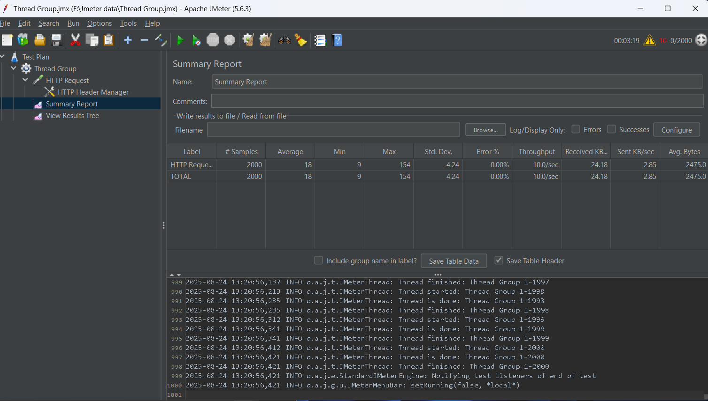

#  Fullstack Job Portal | Java Spring Boot + React (Vite) + MySQL

This is a personal Fullstack Job Portal project built individually using Spring Boot (Java 21), React (Vite) and MySQL.
It includes secure authentication with JWT, role-based access control, job posting & applications, resume uploads, messaging and an Admin Dashboard. 
Designed and developed from scratch to demonstrate fullstack engineering skills with Spring Boot & React.
---

##  Table of Contents
- [Project Overview](#-project-overview)
- [Why This Project?](#-why-this-project)
- [My Role as Developer](#-my-role-as-developer)
- [Architecture](#%EF%B8%8F-architecture)
- [Screenshots](#-screenshots)
- [Key Features](#-key-features-functional-requirements)
  - [Authentication & Authorization](#-authentication--authorization)
  - [Messaging System](#-messaging-system)
  - [Role Capabilities](#-role-capabilities)
    - [Job Seekers](#-job-seekers)
    - [Employers](#-employers)
    - [Admins](#%EF%B8%8F-admins)
  - [File Uploads](#-file-uploads)
- [Non-Functional Requirements](#%EF%B8%8F-non-functional-requirements)
- [Tech Stack](#%EF%B8%8F-tech-stack)
- [Setup Instructions](#%EF%B8%8F-setup-instructions)
  - [Prerequisites](#-prerequisites)
  - [Backend Setup](#%EF%B8%8F-backend-setup)
  - [Frontend Setup](#-frontend-setup)
- [Continuous Integration & Code Quality](#%EF%B8%8F-continuous-integration--code-quality)
- [Author](#-author)


##  Project Overview

This fullstack Job Portal allows seamless interaction between Employers and Job Seekers. Key features include:

 Employers can post, update, and delete job listings and manage applications.

 Job Seekers can browse, search, filter and apply to jobs with uploaded resumes.

 Secure login, registration and password management using Spring Security

      Passwords are hashed with BCryptPasswordEncoder
      
      JWT-based authentication for stateless sessions
      
      Role-based access control enforced via @PreAuthorize annotations

 Messaging system enabling Employers and Job Seekers to communicate securely based on application status.

 Upload and view resumes, profile pictures and company logos securely.

---

##  Architecture

| Layer    | Stack                                                                            |
| -------- | -------------------------------------------------------------------------------- |
| Frontend | React, Vite, Tailwind CSS, ESLint     |
| Backend  | Java 21, Spring Boot, PMD                      |
| Database | MySQL (local development), MariaDB via SkySQL (CI)                               |
| Tools    | Git, GitHub,Maven, Postman, JUnit                                                |

---

##  Screenshots

###  Admin Dashboard


###  View Job Applications


###  Job Details Page


###  Profile View


##  Key Features (Functional Requirements)

###  Authentication & Authorization

- Login / Register / Forgot Password via email service
- **JWT Token** based secure authentication
- Role-based access control for Employers, Job Seekers and Admins
- Logout functionality for all roles

###  Messaging System

- Employers can message job seekers only **after a job application** exists
- Admins can message anyone
- Self-messaging and same-role messaging is **prohibited**
- **Read receipts** are enabled (users can see if their message was viewed)
- **Messages cannot be deleted** to ensure platform integrity

###  Role Capabilities

####  Job Seekers

- Browse and search all job posts
- Apply to jobs with attached resume
- View and update profile
- Upload resume to profile and during job applications
- View submitted applications

####  Employers

- Post, edit, delete **only their own jobs**
- View received job applications
- Approve, reject or delete job applications
- View and update profile
- See all jobs on the portal

####  Admins

- View **all** jobs, applications, employers and seekers
- Activate or Deactivate User Accounts
- Delete inappropriate jobs
- Monitor platform activities

###  File Uploads

- Upload and view resumes (PDF)
- Upload and view profile pictures and company logos

---

##  Non-Functional Requirements

###  Performance
- APIs respond within **<200ms** for common operations (job search, profile retrieval)  
- Supports **2000+ concurrent users** with minimal latency.  

**Load Testing Results (Proof):**

- **Concurrent Users Tested:** 2000  
- **Total Requests:** 2000  
- **Average Response Time:** 18 ms  
- **Max Response Time:** 154 ms  
- **Std. Dev.:** 4.24  
- **Error %:** 0%  
- **Throughput:** 10 requests/sec  


  

###  Security
- Passwords hashed with **BCryptPasswordEncoder**  
- **JWT-based authentication** for stateless sessions  
- Role-based access enforced via **Spring Security**  
- Secure file uploads (resumes, profile images, company logos)  

###  Usability
- **Responsive design** across desktop, tablet and mobile  
- Accessibility improvements (labels, ARIA roles, contrast)  

###  Scalability
- REST APIs structured for horizontal scaling  
- Indexed queries in MySQL for efficient job searching  

###  Reliability & Availability
- Error handling with descriptive fallback messages  
- Auto-recovery on backend restart  

###  Maintainability
- Layered architecture (controllers, services, repositories)  
- Static code analysis with **PMD & SpotBugs**  
- Consistent coding conventions and modular structure  

###  Portability
- Backend deployable on **AWS EC2** or any cloud VM   

##  Tech Stack

**Frontend:**  
 
 
 
 

**Backend:**  
 
 
 
 

**Database:**  
 


**Testing:**  
 
 
 


**Code Quality:**  
 
 


**DevOps & Tools:**  
 
 
 
 


##  Setup Instructions

###  Prerequisites

- Java 21
- Node.js & npm
- MySQL Server
- Maven

###  Backend Setup

```sql
CREATE DATABASE job_portal;
```

**Edit `application.properties`:**

```properties
spring.datasource.url=jdbc:mysql://localhost:3306/job_portal
spring.datasource.username=root
spring.datasource.password=your_password
spring.jpa.hibernate.ddl-auto=update
```

**Run Backend:**

```bash
./mvnw spring-boot:run
```

###  Frontend Setup

```bash
cd frontend
npm install
npm run dev
```

---

##  Continuous Integration & Code Quality

Configured **GitHub Actions** to automatically run workflows on every push and pull request.

####  Backend CI
- Builds the Spring Boot project with Maven
- Runs JUnit tests for backend services
- Connects to **SkySQL (MariaDB)** for integration tests

####  Frontend CI
- Runs ESLint for linting and formatting checks
- Detects unused variables, accessibility issues, and potential React bugs
- Prevents merging code with style or quality violations

####  Local Developer Quality Checks
*(Run manually in IntelliJ IDEA — not enforced in CI)*
-  PMD → Detects code smells, complexity issues, and unused imports
-  SpotBugs → Finds potential runtime bugs, null-pointer risks, and concurrency problems

####  Benefits
-  Catch bugs and regressions before deployment
-  Maintain consistent code style across frontend & backend
-  Faster feedback loops with automated tests
-  Higher reliability and maintainability of the codebase


##  Author

**Sandun Munasinghe**
📧 [e20259@eng.pdn.ac.lk](mailto:e20259@eng.pdn.ac.lk)
📧 [msandunlakshan2001@gmail.com](mailto:msandunlakshan2001@gmail.com)
🔗 [GitHub Profile](https://github.com/SandunMunasinghe20)


